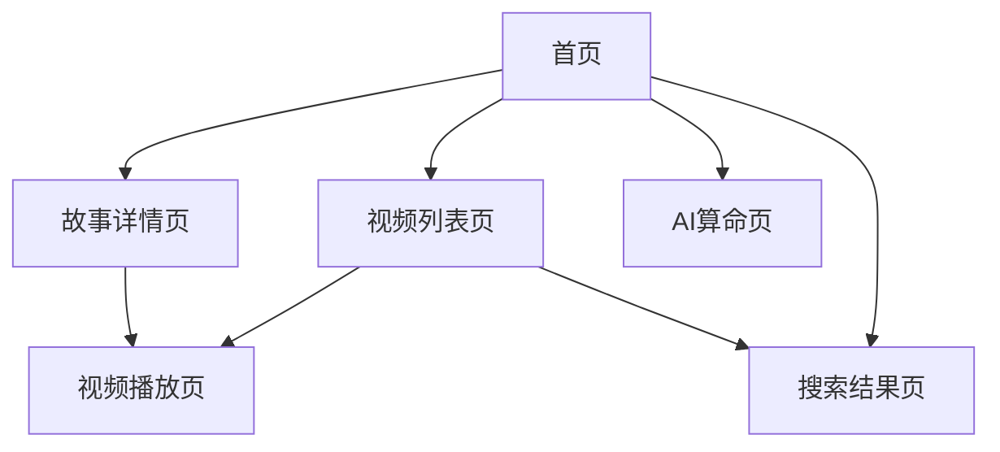

# 怖客 - 恐怖灵异内容聚合平台 PRD

## 1. 产品概览

怖客是一款专注于全简中互联网恐怖灵异内容聚合的网页应用，通过爬虫技术收集相关博客评论区数据，筛选用户推荐度高的故事内容进行整合展示。

- 解决用户难以找到高质量恐怖灵异内容的问题，为用户提供精选的恐怖故事和视频资源
- 目标是成为中文互联网最大的恐怖灵异内容聚合平台，为爱好者提供一站式内容服务

## 2. 核心功能

### 2.1 用户角色

| 角色 | 注册方式 | 核心权限 |
|------|---------|----------|
| 普通用户 | 无需注册 | 浏览内容、搜索内容、观看视频、使用AI功能 |

### 2.2 功能模块

我们的怖客平台包含以下主要页面：
1. **首页**：至臻系列展示、热门视频TOP10、本期主题、提及排行榜、访客统计、AI推荐
2. **视频列表页**：所有视频展示、搜索功能、筛选功能
3. **故事详情页**：故事内容展示、相关视频推荐
4. **搜索结果页**：搜索结果展示、筛选功能
5. **AI算命页**：命理分析、AI预测

### 2.3 页面详情

| 页面名称 | 模块名称 | 功能描述 |
|---------|---------|----------|
| 首页 | 顶部导航 | 包含“全部视频”按钮和搜索按钮，固定在页面顶部 |
| 首页 | 至臻系列 | 展示精选的恐怖故事系列，包含故事名称、封面、时长等信息，支持点击跳转到对应视频 |
| 首页 | 热门视频TOP10 | 展示播放量最高的10个视频，包含排名、封面、标题、播放量、评论数等信息，支持点击查看AI总结和跳转到视频 |
| 首页 | 本期主题 | 展示当前主题和相关关键词 |
| 首页 | 提及排行榜 | 展示被用户提及次数最多的故事排行榜 |
| 首页 | 访客统计 | 展示网站访问统计数据，包括总访问量、今日访问量等 |
| 首页 | AI推荐 | 基于用户行为推荐相关视频 |
| 视频列表页 | 视频列表 | 展示所有视频，支持按时间、播放量等排序，每页显示12个视频 |
| 视频列表页 | 搜索功能 | 支持按标题、BV号、期数搜索视频 |
| 视频列表页 | 筛选功能 | 支持按分类（全部、道听途说正集、道听途说特辑、都市传说）筛选视频 |
| 视频列表页 | 分页功能 | 支持分页浏览视频，每页12个视频 |
| 视频列表页 | AI总结 | 展示视频的AI总结，支持展开/收起查看完整总结 |
| 视频列表页 | AI语义搜索 | 基于向量数据库的语义搜索，支持关键词搜索和智能筛选 |
| 视频列表页 | 智能筛选 | 支持按浏览量、评论数、时长、更新时间筛选和排序 |
| 故事详情页 | 故事内容 | 展示故事详细内容 |
| 故事详情页 | 相关视频 | 推荐相关视频 |
| 搜索结果页 | 搜索结果 | 展示搜索结果，支持排序和筛选 |
| AI算命页 | 个人信息输入 | 输入姓名、性别、出生日期、出生时间等信息 |
| AI算命页 | 命理分析 | 基于输入信息生成命理分析报告 |

## 3. Core Process

用户操作流程：

1. 用户访问首页，浏览至臻系列和热门视频
2. 用户可以点击视频跳转到B站观看，或点击AI按钮查看视频的AI总结
3. 用户可以使用搜索功能查找特定视频或故事
4. 用户可以点击“全部视频”按钮进入视频列表页
5. 在视频列表页，用户可以按分类筛选视频，搜索视频，或分页浏览
6. 用户可以访问AI算命页面进行命理分析



## 4. 用户接口设计

### 4.1 设计风格

- **主色调**：黑色、红色、紫色，营造恐怖神秘的氛围
- **按钮风格**：渐变背景，悬停效果，圆角设计
- **字体**：无衬线字体，标题使用粗体和渐变效果
- **布局风格**：响应式设计，卡片式布局，深色背景
- **图标风格**：使用与恐怖主题相关的emoji和图标

### 4.2 页面设计概览

| 页面名称 | 模块名称 | UI元素 |
|---------|---------|--------|
| 首页 | 顶部导航 | 包含“全部视频”按钮和搜索按钮，固定在页面顶部 |
| 首页 | 至臻系列 | 水平滚动的卡片列表，每个卡片包含故事封面、名称、期数、时长等信息 |
| 首页 | 热门视频TOP10 | 垂直列表，每个项目包含排名、封面、标题、播放量、评论数、AI按钮等 |
| 首页 | 本期主题 | 卡片式设计，展示主题和关键词标签 |
| 首页 | 提及排行榜 | 列表式设计，展示排名和提及次数 |
| 首页 | 访客统计 | 卡片式设计，展示访问数据 |
| 首页 | AI推荐 | 卡片式设计，展示推荐视频 |
| 视频列表页 | 视频列表 | 网格布局，每个卡片包含封面、标题、播放量、上传日期等信息 |
| 视频列表页 | 搜索栏 | 顶部搜索框，支持实时搜索结果预览 |
| 视频列表页 | 分类筛选 | 按钮组形式，支持按分类筛选视频 |
| 视频列表页 | 分页控件 | 底部分页按钮，支持页码跳转 |
| 视频列表页 | AI总结 | 卡片式设计，展示视频的AI总结，支持展开/收起 |
| AI算命页 | 表单 | 包含姓名、性别、出生日期、出生时间、问题等输入字段 |
| AI算命页 | 结果展示 | 卡片式设计，展示命理分析结果 |

### 4.3 自适应

- 桌面端：完整布局，多列展示
- 平板端：适当调整布局，减少列数
- 移动端：单列布局，优化触摸交互

## 5. 技术实现

### 5.1 技术栈

- **前端**：Next.js 14 + React 18 + TypeScript + Tailwind CSS
- **后端**：Node.js + Express
- **爬虫**：Python脚本（Puppeteer + Cheerio）
- **数据存储**：JSON文件（生产环境可扩展为MySQL + Redis + Elasticsearch）
- **部署**：Vercel（前端）、Node.js服务器（后端）

### 5.2 API接口

| API路径 | 方法 | 功能描述 | 请求参数 | 成功响应 |
|---------|------|----------|----------|----------|
| /api/v1/stories | GET | 获取故事列表 | page, limit, sort | `{code: 200, data: [...stories]}` |
| /api/v1/stories/:id | GET | 获取故事详情 | id | `{code: 200, data: story}` |
| /api/v1/stories/hot | GET | 获取热门故事 | limit | `{code: 200, data: [...stories]}` |
| /api/v1/videos/:bvid | GET | 获取视频详情 | bvid | `{code: 200, data: video}` |
| /api/v1/search | GET | 搜索故事 | q | `{code: 200, data: [...results]}` |
| /api/v1/summarize/:bvid | GET | 获取视频AI总结 | bvid | `{code: 200, data: summary}` |
| /api/v1/stats | GET | 获取访问统计 | - | `{code: 200, data: stats}` |
| /api/v1/track | POST | 记录用户行为 | event, data | `{code: 200, message: "success"}` |

### 5.3 数据结构

**Story**
```typescript
interface Story {
  id: number;
  name: string;
  title: string;
  bvid: string;
  timestamp: number;
  heat: number;
  mention_count: number;
  review: string;
  length: number;
  author: string;
  tags: string[];
  time_markers: string[];
  related_bvs: string[];
  jump_url: string;
}
```

**VideoItem**
```typescript
interface VideoItem {
  id: number;
  bvid: string;
  video_url: string;
  cover_url: string;
  cover_local: string;
  play_count: number;
  comment_count: number;
  duration: number;
  duration_str: string;
  title: string;
  upload_date: string;
  episode: number;
  part: string;
  keywords?: { word: string; weight: number }[];
  ai_summary?: string;
}
```

**Top10Video**
```typescript
interface Top10Video {
  rank: number;
  bvid: string;
  episode: number;
  title: string;
  play_count: number;
  cover_url: string;
  cover_local: string;
  comment_count: number;
  timestamp?: number;
  comments: HelpComment[];
}
```

**HelpComment**
```typescript
interface HelpComment {
  id: number;
  content: string;
  author: string;
  like: number;
  time: number;
  keyword: string;
  reply_count: number;
  has_replies: boolean;
  replies: {
    id: number;
    content: string;
    author: string;
    like: number;
    time: number;
  }[];
  weight: number;
}
```

**ZhizhenSeries**
```typescript
interface ZhizhenSeries {
  id: string;
  title: string;
  description: string;
  stories: ZhizhenStory[];
}

interface ZhizhenStory {
  order: number;
  name: string;
  color: string;
  bvid: string;
  episode: number;
  part: string;
  title: string;
  timestamp: number;
  time_str: string;
  cover_url: string;
  cover_local: string;
}
```

**AISummary**
```typescript
interface AISummary {
  bvid: string;
  title: string;
  summary: string;
  generated_at: string;
}
```

**VisitorStats**
```typescript
interface VisitorStats {
  total_visits: number;
  today_visits: number;
  yesterday_visits: number;
  weekly_visits: number;
  monthly_visits: number;
  last_visit: string;
}
```

**TrackEvent**
```typescript
interface TrackEvent {
  event_type: string; // 'video_click', 'ai_summary_view', 'page_view'
  event_data: {
    bvid?: string;
    page?: string;
    timestamp: number;
  };
  user_agent: string;
  ip: string;
}
```

## 6. 部署与集成

### 6.1 部署方案

- **前端**：部署到Vercel，利用其静态网站托管和Serverless Functions功能
- **后端**：部署到Node.js服务器，使用PM2管理进程
- **爬虫**：部署到定时任务服务器，定期执行数据采集

### 6.2 集成方案

- **数据集成**：爬虫采集数据 → 处理分析 → 生成JSON文件 → 前端加载
- **API集成**：前端通过API调用后端服务，获取动态数据
- **第三方集成**：集成B站视频播放、AI API等第三方服务

## 7. 监控与维护

### 7.1 监控方案

- **访问统计**：使用访客统计面板监控网站访问量
- **错误监控**：前端错误捕获和日志记录
- **性能监控**：页面加载速度和API响应时间监控
- **用户行为分析**：通过数据埋点分析用户行为

### 7.2 维护方案

- **数据更新**：定期运行爬虫更新数据
- **内容审核**：定期审核用户提交的内容
- **安全维护**：定期更新依赖包，修复安全漏洞
- **性能优化**：定期优化代码和数据库查询

## 8. 版本计划

### 8.1 现有功能（V1.0）

- ✅ 首页展示（至臻系列、热门视频TOP10、本期主题、提及排行榜）
- ✅ 视频列表页（支持搜索、筛选、分页）
- ✅ 故事详情页
- ✅ 搜索功能
- ✅ AI视频总结功能
- ✅ 访客统计
- ✅ AI推荐
- ✅ AI算命功能
- ✅ API防盗用设计
- ✅ 数据埋点（视频点击量、AI功能使用量）

### 8.2 后续计划（V1.1+）

- **V1.1**：增加更多数据源，扩展内容覆盖范围
- **V1.2**：用户系统与收藏功能
- **V1.3**：移动端App
- **V2.0**：社区功能与用户投稿

## 9. 风险评估

### 9.1 潜在风险

- **内容版权**：需要确保使用的内容符合版权要求
- **API限制**：第三方API可能存在调用限制
- **性能问题**：随着数据量增加，可能出现性能瓶颈
- **安全问题**：需要防止API滥用和恶意攻击
- **数据存储**：JSON文件存储在数据量增大时可能导致性能问题

### 9.2 应对措施

- **内容版权**：只使用合法获取的内容，注明来源
- **API限制**：实现请求频率限制，缓存API响应
- **性能问题**：优化数据结构，实现数据缓存，考虑使用数据库存储
- **安全问题**：实现API密钥验证，IP黑名单，请求频率限制
- **数据存储**：计划在V1.1版本迁移到数据库存储